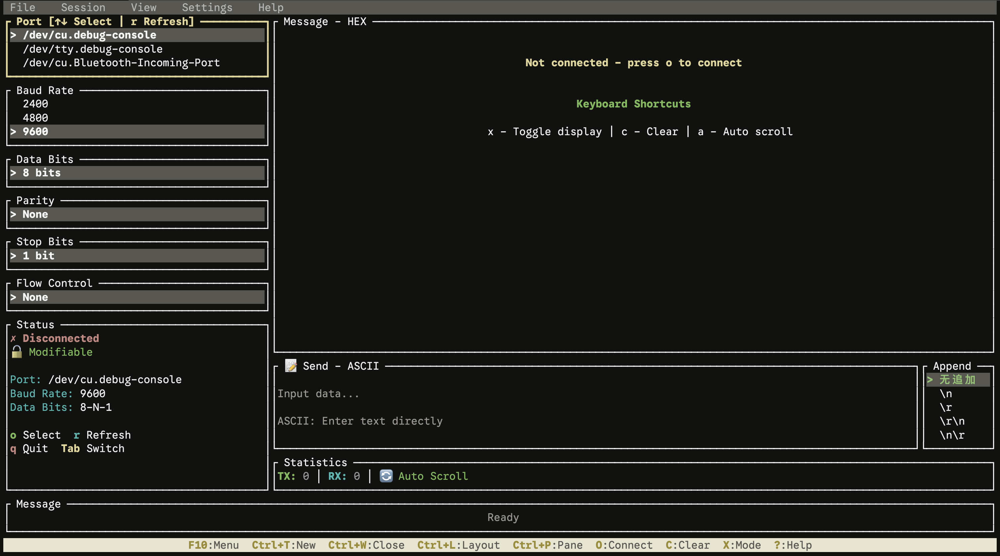

# TuiSerial - Terminal Serial Port Debugger

A modern TUI serial port debugging tool built with Rust + Ratatui, featuring complete keyboard and mouse interaction.

[中文文档](README-CN.md) | English



## 📦 Installation

### Install from crates.io

```bash
cargo install tuiserial
```

Run:
```bash
tuiserial
```

### Build from Source

1. Clone the repository: `git clone https://github.com/yourusername/tuiserial.git`
2. Enter directory: `cd tuiserial`
3. Build: `cargo build --release`
4. Run: `cargo run --release`

### Use Pre-compiled Binaries

1. Download binary: [Download Link](https://github.com/yourusername/tuiserial/releases)
2. Extract the archive
3. Run: `./tuiserial`

## ✨ Features

### Core Features
- **Complete Serial Configuration**: Port selection, baud rate, data bits, parity, stop bits, flow control
- **Configuration Persistence**: Auto save/load config to `~/.config/tuiserial/config.json` 💾
- **Config Lock Mechanism**: Auto-lock config after connection to prevent misoperations, unlock after disconnect 🔒
- **Smart Status Display**: Real-time connection status and complete config info (8-N-1 format)
- **Internationalization Support**: English and Chinese, default English 🌍
- **Menu Bar Navigation**: Standard menu bar (File/Settings/Help), supports keyboard and mouse
- **Dual Display Modes**: HEX and TEXT modes, real-time switching
- **Clean Message Format**: `[Time] ◄ RX (Bytes) Data` - clear and intuitive
- **Bidirectional Data Transfer**: Support HEX/ASCII send modes
- **Flexible Append Options**: Choose to append `\n`, `\r`, `\r\n`, `\n\r` or none
- **Real-time Data Reception**: Efficient circular buffer, supports up to 10000 log lines
- **Auto/Manual Scroll**: Smart auto-tracking or manual browsing of historical data
- **Quick Operations**: Fast toggle between configs and display modes

### Interaction Features
- **Full Keyboard Control**: Vim-style shortcuts + standard navigation + F10 menu
- **Comprehensive Mouse Support**: Click, right-click, middle-click, scroll wheel, menu bar clicks
- **Real-time Statistics**: Tx/Rx byte count and connection status
- **Notification System**: Operation feedback and error alerts, multilingual support

### UI Optimizations
- **Status Panel Redesign**:
  - Connection status: `✓ Connected` / `✗ Disconnected`
  - Config status: `🔓 Modifiable` / `🔒 Locked`
  - Complete config info: Port, Baud rate, Config format (8-N-1)
- **Message Log Optimization**:
  - Clean title: `Message - HEX | 123 items [x toggle | c clear]`
  - Unified format: `[Time] ◄ RX (Bytes) Data`
  - Smart hints: Show connection status and shortcuts when log is empty
- **Config Lock Indicator**: Display `[Locked]` marker when connected, border turns gray
- **Append Option Selector**: Independent right panel for quick line ending selection
- **Highlight Hints**: Focused field in yellow, selected items bold, locked fields in gray

## 📦 Project Structure

Modular architecture managed with Cargo Workspace:

```
tuiserial/
├── Cargo.toml                 # Workspace configuration
├── crates/
│   ├── tuiserial-core/        # Core data models and state management
│   ├── tuiserial-serial/      # Serial communication library (wraps serialport)
│   ├── tuiserial-ui/          # UI rendering components (based on ratatui)
│   └── tuiserial-cli/         # Main binary package (published as "tuiserial")
├── ARCHITECTURE.md            # Detailed architecture documentation
├── LOGIC_VALIDATION.md        # Logic validation and test checklist
├── QUICK_REFERENCE.md         # Quick reference guide
├── README.md                  # This document (English)
└── README-CN.md               # Chinese documentation
```

**Note**: The directory is named `tuiserial-cli` but the package is published as `tuiserial` on crates.io. Users should install with `cargo install tuiserial`.

## 🚀 Quick Start

### Compile

```bash
cd tuiserial
cargo build --release
```

### Run

```bash
./target/release/tuiserial
```

Or run directly:

```bash
cargo run --release --bin tuiserial
```

## ⌨️ Keyboard Shortcuts

### Global Controls
| Shortcut | Function |
|----------|----------|
| `F10` | Open/Close menu bar |
| `q` / `Esc` | Quit program (or close menu) |
| `Tab` | Switch focus to next field |
| `Shift+Tab` | Switch focus to previous field |
| `o` | Open/Close serial connection (locks config when connected) |
| `r` | Refresh serial port list |

### Menu Bar Navigation (F10 to activate)
| Shortcut | Function |
|----------|----------|
| `←` / `→` | Switch menu items |
| `↑` / `↓` | Select in dropdown menu |
| `Enter` | Execute selected menu item |
| `Esc` | Close menu/return to parent |

### Config Panel Navigation (⚠️ Auto-locks after connection)
| Shortcut | Function |
|----------|----------|
| `↑` / `k` | List up/decrease value |
| `↓` / `j` | List down/increase value |
| `←` / `h` | Decrease baud rate |
| `→` / `l` | Increase baud rate |
| `p` | Toggle parity (None → Even → Odd) |
| `f` | Toggle flow control (None → Hardware → Software) |

**Note**: After connecting to serial port, all config parameters are automatically locked and cannot be modified. You must disconnect first to adjust config.

### Log Area
| Shortcut | Function |
|----------|----------|
| `x` | Toggle HEX/TEXT display mode |
| `c` | Clear log |
| `a` | Toggle auto-scroll |
| `PgUp` | Scroll up (10 lines) |
| `PgDn` | Scroll down (10 lines) |
| `Home` | Jump to log beginning |
| `End` | Jump to log end (and enable auto-scroll) |

### Send Area (when focused on input box)
| Shortcut | Function |
|----------|----------|
| `Character keys` | Input characters |
| `Backspace` | Delete previous character |
| `Delete` | Delete next character |
| `←` / `→` | Move cursor |
| `Home` / `End` | Move cursor to start/end |
| `↑` / `↓` | Toggle HEX/ASCII mode |
| `n` | Cycle through append options |
| `Enter` | Send data |
| `Esc` | Clear input |

## 🖱️ Mouse Interaction

### Left Click
- **Menu Bar** → Open menu dropdown
- **Menu Item** → Execute corresponding function
- **Config Panel** → Switch focus and directly select list item
- **Log Area** → Switch focus to log area
- **Input Box** → Switch focus and position cursor
- **Append Options** → Directly select append mode

### Right Click
- **Log Area** → Quick toggle HEX/TEXT display mode
- **Input Box** → Quick toggle HEX/ASCII send mode
- **Append Options** → Cycle through append modes
- **Statistics Area** → Toggle auto-scroll

### Middle Click
- **Log Area** → Quick clear log
- **Input Box** → Quick clear input

### Scroll Wheel
- **Log Area** → Scroll log up/down (3 lines)
- **Config List** → Select up/down in list
- **Append Options** → Cycle through append modes

## 📊 Data Format

### Receive Display Format
```
[14:32:45.123] ◄ RX (   5 B) 48 65 6C 6C 6F
[14:32:45.456] ◄ RX (   5 B) Hello
```

**Format Description**:
- Timestamp accurate to milliseconds
- `◄ RX` Receive direction (cyan bold)
- `► TX` Transmit direction (green bold)
- Byte count right-aligned for easy viewing

### Send Modes
1. **ASCII Mode**: Enter text directly, e.g., `Hello`
2. **HEX Mode**: Enter hexadecimal, space-separated, e.g., `48 65 6C 6C 6F`

### Append Options
- **None**: Don't add any characters
- **\n**: Add line feed (LF, 0x0A)
- **\r**: Add carriage return (CR, 0x0D)
- **\r\n**: Add carriage return line feed (CRLF, 0x0D 0x0A)
- **\n\r**: Add line feed carriage return (LFCR, 0x0A 0x0D)

## 🛠️ Tech Stack

- **Ratatui 0.29**: Modern Rust TUI framework
- **Crossterm 0.28**: Cross-platform terminal control
- **Serialport 4.3+**: Cross-platform serial port access
- **Tokio 1.40**: Async runtime
- **Chrono 0.4**: Timestamp handling
- **Color-eyre 0.6**: Error handling

## 📈 Development Status

### ✅ Implemented
- ✅ Serial port config management (all common parameters)
- ✅ **Configuration persistence** (auto save/load config file)
- ✅ **Menu bar system** (File/Settings/Help, keyboard and mouse support)
- ✅ **Internationalization support** (English/Chinese toggle, zero runtime cost)
- ✅ **Config lock mechanism** (auto-lock after connection, prevent misoperations)
- ✅ **Smart status display** (connection status, config status, complete config info)
- ✅ Data reception display (HEX/TEXT modes)
- ✅ Data transmission (HEX/ASCII modes)
- ✅ Append options (\n, \r, \r\n, \n\r, none)
- ✅ Full keyboard control (including F10 menu shortcuts)
- ✅ Full mouse interaction (click, right-click, middle-click, scroll, menu bar)
- ✅ **Optimized message format** (clean and intuitive log display)
- ✅ Auto/manual scroll
- ✅ Real-time statistics and notification system
- ✅ Complete logic validation (see LOGIC_VALIDATION.md)
- ✅ Modular architecture (Workspace)

### 🔄 Planned
- 🔄 Command presets and quick send
- 🔄 Log export (TXT/CSV/JSON)
- 🔄 Search and filter functionality
- 🔄 Data analysis and charts
- 🔄 Protocol parser plugins
- 🔄 More language support (Japanese, Korean, etc.)
- 🔄 Multiple serial port monitoring
- 🔄 Macro recording and playback

## 📚 Documentation

- [ARCHITECTURE.md](ARCHITECTURE.md) - Detailed architecture design document
- [LOGIC_VALIDATION.md](LOGIC_VALIDATION.md) - Logic validation and test checklist
- [QUICK_REFERENCE.md](QUICK_REFERENCE.md) - Quick reference guide
- [Cargo Workspace](https://doc.rust-lang.org/book/ch14-03-cargo-workspaces.html) - Cargo Workspace official documentation

## 🔐 Core Feature: Config Lock Mechanism

**Why do we need config locking?**
After establishing a serial connection, modifying parameters may cause:
- Communication interruption or data corruption
- Device abnormal response
- Debug information confusion

**Our Solution:**
1. ✅ **Auto-lock on connection** - After pressing `o` to connect, all config parameters are immediately locked
2. ✅ **Visual feedback** - Config panel shows `[Locked]` marker, border turns gray
3. ✅ **Operation interception** - Any modification attempt shows warning: "Config locked, please disconnect first"
4. ✅ **Unlock on disconnect** - Press `o` again to disconnect, config returns to modifiable state
5. ✅ **Status sync** - Status panel displays current config and lock status in real-time

**Actual Effect:**
```
When disconnected:
  Status: ✗ Disconnected
  Config: 🔓 Modifiable
  → Can freely adjust all parameters

When connected:
  Status: ✓ Connected
  Config: 🔒 Locked
  Port: /dev/ttyUSB0
  Baud: 115200
  Config: 8-N-1
  → Parameters locked, cannot modify

After disconnect:
  Status: ✗ Disconnected
  Config: 🔓 Modifiable
  → Returns to modifiable state
```

## 🤝 Contributing

Issues and Pull Requests are welcome!

1. Fork this project
2. Create feature branch (`git checkout -b feature/AmazingFeature`)
3. Commit changes (`git commit -m 'Add some AmazingFeature'`)
4. Push to branch (`git push origin feature/AmazingFeature`)
5. Open Pull Request

## 📝 License

MIT License

## 👨‍💻 Author

pengheng <m18511047688@163.com>

## 🌍 Internationalization

Currently supported:
- **English** (default)
- **中文** (Chinese)

Switch language:
- Press `F10` to open menu
- Select `Settings` → `Toggle Language`
- Or click directly on menu bar

Technical implementation:
- Uses `phf` for compile-time static HashMap
- Zero runtime overhead, all translations embedded at compile time
- Fallback mechanism: returns key itself if translation not found
- Simple and direct, no complex framework dependencies

## 💾 Configuration File

Config auto-saves to:
- **Linux/macOS**: `~/.config/tuiserial/config.json`
- **Windows**: `%APPDATA%\tuiserial\config.json`

Config content:
```json
{
  "port": "/dev/ttyUSB0",
  "baud_rate": 115200,
  "data_bits": 8,
  "parity": "None",
  "stop_bits": 1,
  "flow_control": "None"
}
```

Operations:
- **Save Config**: Menu → File → Save Config
- **Load Config**: Menu → File → Load Config (auto-loads on startup)
- Uses default config if config file is corrupted, no crashes

---

**⭐ If this project helps you, please give it a Star!**